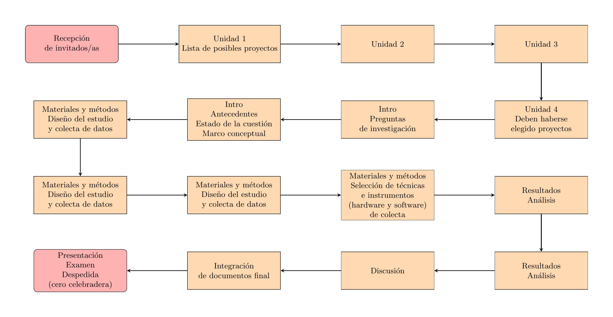

```{r setup, include=FALSE}
options(htmltools.dir.version = FALSE)
knitr::opts_chunk$set(message = F, warning = F)
```

class: center, middle
background-image: url(img/fondo.jpg)

---

# ¡Bienvenidas y bienvenidos!

- **Fechas**:
  - FC-203: del **18 de agosto al 14 de diciembre, 2025**, de 4 a 8 pm
  - **Salida de campo**: depende

- **Logística**

  - Baños
  
  - WiFi

  - Aula + proyector
  
  - Materiales de apoyo impresos y digitales
  
  - Recomendaciones para las actividades de campos/exteriores

---

- **Presentación general del contenido**

  - Programa
  
  - Evaluación
  
  <!-- - consulta y votación para puntuación -->
  
  - Libros de texto
  
  - Recursos de aprendizaje

---

## Formulario

Por favor, completa este formulario: [https://forms.gle/MiRgf1bKSTw8vZGX6](https://forms.gle/MiRgf1bKSTw8vZGX6)

```{r, warning=F, message=F, echo=F}
library(qrcode)
jpeg('img/qrcode-form-nombre-correo.jpg', width = 200, height = 200)
plot(qr_code("https://forms.gle/MiRgf1bKSTw8vZGX6"))
invisible(dev.off())
```


---

## Organización del curso




---

## Autopresentación

- Nombres, apellidos

- Formación y/o área profesional

- Municipio de residencia

- Una expectativa de la materia

---

# ¿Qué necesitas?

- Libreta o bitácora

- Lápiz o bolígrafo

- Teléfono móvil

- Ropa cómoda para la salida de campo (botas, gorra, agua, protector solar)

- Si tienes una PC portátil, tráela para las sesiones de aula (opcional)

- ¡Curiosidad y ganas de observar el mundo físico!

---

# Algunas publicaciones  del ámbito de la biogeografía

- Journal of Biogeography

- Global Ecology and Biogeography

- Peer Community Journal. Comunidad de revisión por pares Peer Community In Ecology (PCI Ecology)

- Ecology

- Ecography

- Biotropica

- Journal of Ecology

- Oikos


---

class: center, middle

<!-- # Comencemos -->

<!-- ### "No se vislumbra vestigio de un principio, ni perspectiva de un fin." -->
<!-- ### — *James Hutton* -->

<!-- Esto, traducido, sería algo así como "seguimos ..." -->